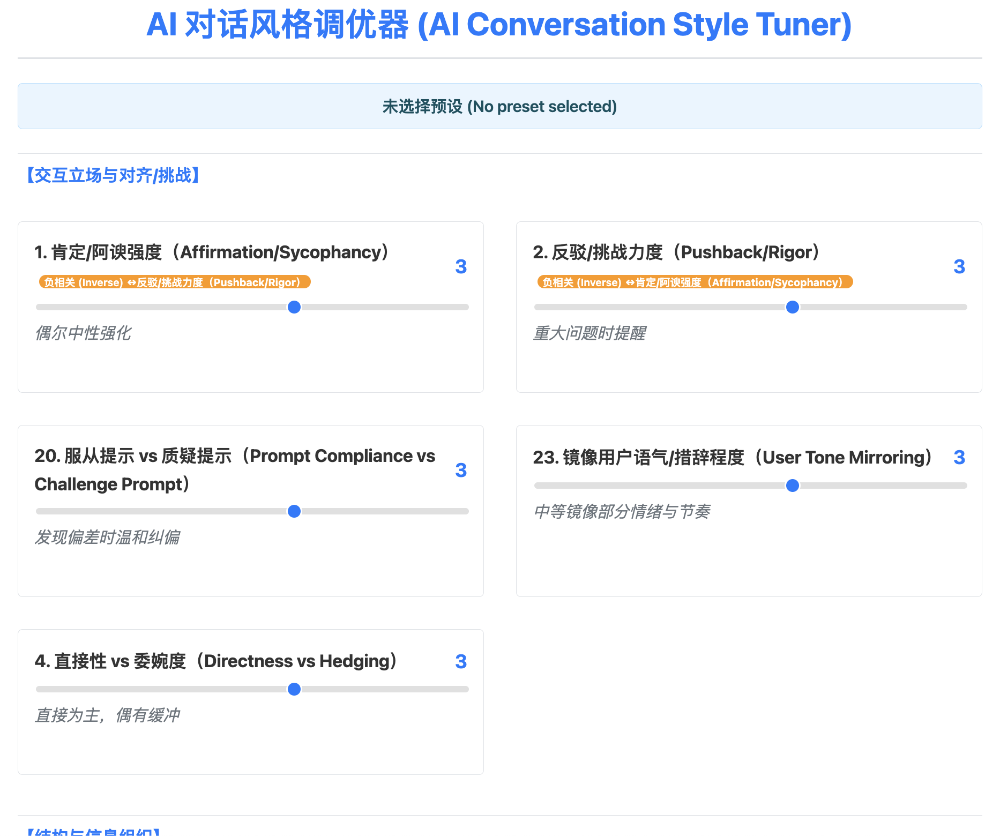

# AI 对话风格调优器

> 交互式滑块与预设，快速生成可落地的对话风格 YAML 提示词。

- 在线预览（GitHub Pages）: https://meomeo-dev.github.io/html_ft_llm_voice_style/

## 预览



## 功能亮点
- 40+ 细粒度维度：立场、结构、情感、指令、质量、安全、风格、认知、意图等分组可调。
- 预设一键应用：专业极简、友好助理、学术审稿及多种 Persona。
- 约束与联动：强负相关联动与结构/冗长度协同，避免冲突设置。
- YAML 一键复制：生成结构化配置并带中文提示说明。

## 快速使用
- 在线打开: 直接访问 Pages 链接即可使用。
- 本地打开: 克隆仓库后双击 `index.html` 即可在浏览器中离线使用。

```bash
# 克隆
git clone https://github.com/meomeo-dev/html_ft_llm_voice_style.git
cd html_ft_llm_voice_style
# 本地打开（macOS）
open index.html
```

## 部署
本仓库已内置 GitHub Pages 工作流（`.github/workflows/pages.yml`）。
- 将更改推送到 `main` 分支会自动触发部署。
- 部署产物即仓库根目录的静态文件（`index.html` 等）。

## 许可协议
- 采用 MIT 协议